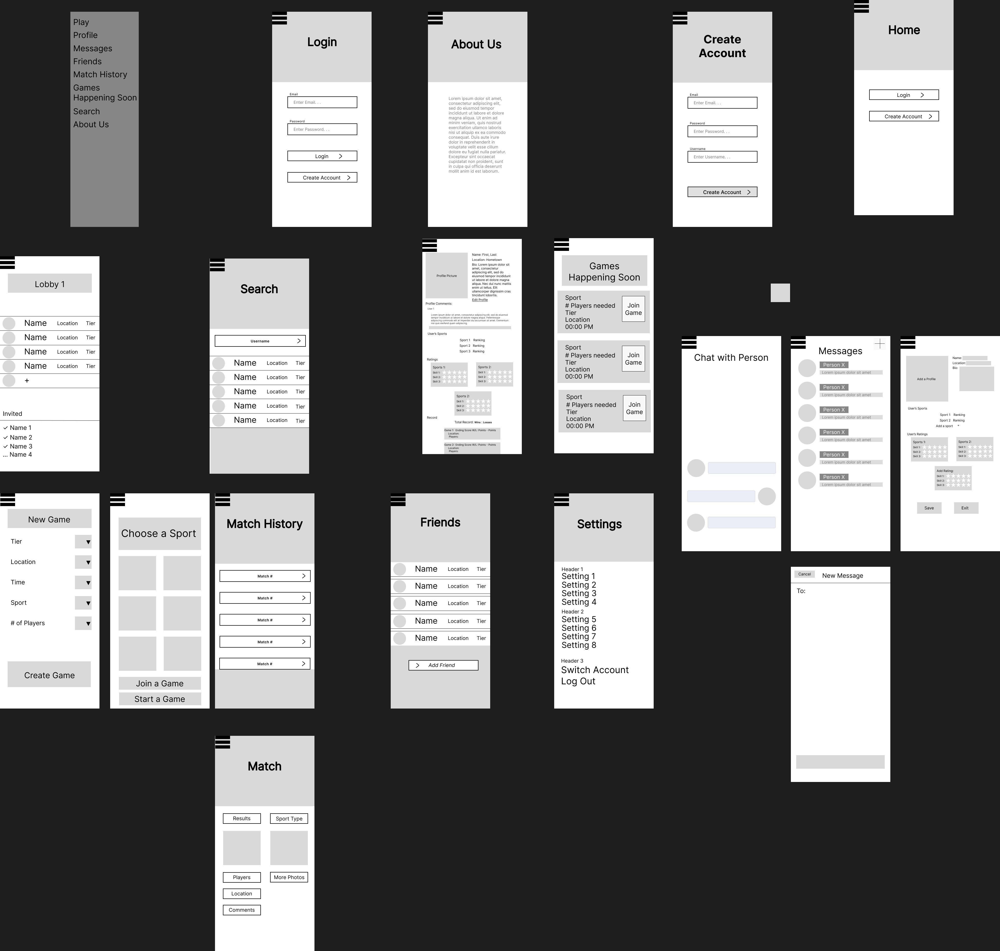

# User Experience Design

## App Map

## Wireframe

## Prototype 
[Link to Prototype](https://www.figma.com/file/fBGItxAaTYcv6m0Q0QDgHZ/Huddle-WIreframe?type=design&node-id=0-1&mode=design&t=X7By04Qhzz4s84f9-0)

### Home
Home page allows you to login or create a new account.

### Login
Login page allows you to use your email and password to login. You can also jump to create a new account page.

### Create Account
Allows the user to create a new account with its email address, password, and username.

### Profile
This page allows users to view their own profile and also has the same layout as viewing another user’s profile. Includes user name, location, bio, profile picture, list of sports, ratings of skills, and a quick look at previous games.

### Edit Profile
Edit profile allows users to change certain aspects of their profile including name, location, bio, profile pic, sport(s), and self-ratings.

### Play
This screen serves to allow the user to pick a sport, then join or create a game for that respective sport

### Games Happening Soon

### Lobby
This screen allows you to view all current members in the lobby of the game, with the ability invite other players and see who has accepted their invitations

### Messages
List of friends who you have messaged in the past 

### Friends
Friends lists all you added friends in this app, and displays some basic information such as locations and current status. Clicking on one in the list will lead you to the friend’s profile page

### Match History
Match History lets you see the previous matches you’ve played, and further information about the match, including results, locations, scores(if any), players, comments, photos, etc. if you clicked on the detailed match page

### Search
This screen allows you to search for other users and view their profiles

### About Us
This page breifly summarizes what Huddle is all about.